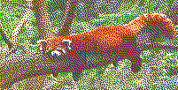
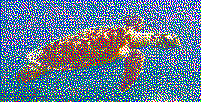

# TwoSidedRubiksCubeMosaic
### Created by Diego Zamalloa-Chion and Vinny Pagano

Generates a wall of 3x3x3 Rubik's cubes showing any desired pair of images on the front and back respectively.

**Warning: for the result to look really good, you'll probably need >1000 cubes (depending on the desired amount of detail). Smaller mosaics will likely have lots of noise given the constraints on how the cube can move.**

Recommended Usage:
- Find two images (ideally of equal aspect ratio) which you would like to appear on the mosaic.
  - Note: The algorithm stretches both images to fit the desired dimensions, so perform cropping and other preprocessing as necessary so that image1, image2, and the mosaic all have the same aspect ratio.
- Call FloydSteinbergPancakeDither
  - The first two arguments are the file names of the images.
  - The next two arguments are the names of the output bitmap images which you can use to view what the final mosaic should look like in Rubik's cube colors.
  - The next argument is the desired dimensions of the mosaic as a tuple of width and height. (Note: both dimensions must be multiples of three for the mosaic to be made of the canonical cubes) Play around with different dimensions to minimize the number of cubes you need but also maximize the amount of detail that comes through in the final result.
  - The final argument is the color palette. Input the six colors of the Rubik's cube as 3D Vectors (0 to 255 for the three RGB channels). By default, the colors are White, Red, Green, Yellow, Orange, Blue, corresponding to the Top, Right, Front, Bottom, Left, and Back faces of the cubes respectively. For best results, make sure that your colors have the exact RGB values of the cube under the lighting conditions of the final location of the mosaic.
- FloydSteinbergPancakeDither should return a list of Cube objects which correspond to the mosaic if you concatenated every row in order. On these Cube objects, you can call:
  - getTopAndFront() to get the correct orientation of the cube 
  - getSolution() to get the moves taking you from the solved cube to the scramble required at that location in the mosaic.

Here is an example run of the algorithm:
```
cubes = FloydSteinbergPancakeDither('red_panda.jpeg','sea_turtle.jpeg','red_panda.bmp','sea_turtle.bmp', size=(201,102), colors=[
    # White
    Vector(255, 255, 255),
    # Red
    Vector(255, 0, 0),
    # Green
    Vector(0, 255, 0),
    # Yellow
    Vector(255, 255, 0),
    # Orange
    Vector(255, 165, 0),
    # Blue
    Vector(0, 0, 255)])
for c in cubes:
    print(c.getTopAndFront(), c.getSolution())
```
These are the bitmap files generated by the algorithm (red_panda.bmp, sea_turtle.bmp).




FloydSteinbergPancakeDither should complete in under two minutes for 102x102 pixel images.

Beware of running Cube() on a random string, since if it doesn't immediately encounter a contradiction, the algorithm can end up testing every configuration of Rubik's cubes which is why there is a wait_time argument. If the algorithm hasn't found a valid cube configuration in 1 second, it probably never will and the program will exit.

Major thanks to the following respositories for providing source material for this project. [Kociemba](https://github.com/muodov/kociemba) gave us the solver to get to any valid cube state, [Tesselate](https://github.com/adlrwbr/Tessellate) gave us the starting point for the dithering we ended up using. 

Feel free to email me if you have the cubes for a mosaic like this and/or would like some help using the code.